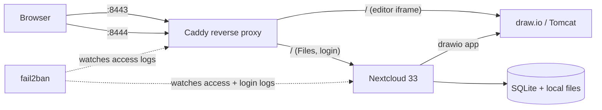

# DrawStack

A self-hosted replacement for Lucidchart: a document library (Nextcloud) plus
an infinite-canvas diagram editor (draw.io), running on a single VPS behind
Caddy, with brute-force protection and a folder-organized migration path off
Lucidchart. No SaaS subscription, no third-party storage of the diagrams.

## Why

Lucidchart delivers two things worth paying for: a place to browse saved
diagrams organized into folders, and a canvas editor. Bare draw.io is only
the second — it has no document library at all. This project wires the two
together, self-hosted, on infrastructure already running other services.

## Architecture



- **Nextcloud** — the document library: folders, file list, "+New" menu,
  search. SQLite backend (fine for a single user, no separate DB container).
- **draw.io** (`jgraph/drawio`) — the canvas editor, opened in an iframe by
  Nextcloud's official `drawio` integration app. Diagrams never leave the box.
- **Caddy** — existing reverse proxy on the host, extended with two new site
  blocks (`:8443`, `:8444`) on new ports of the same hostname, reusing the
  existing TLS certificate.
- **fail2ban** — two jails: one watching Caddy's access log for repeated
  401s, one watching Nextcloud's own log for failed logins. Both ban an
  offending IP for an hour after 5 failures in 10 minutes.

## Migrating off Lucidchart

draw.io's own Lucid importer depends on a Chrome extension that reads your
Lucid session from inside a **hidden iframe** — which browsers now block by
default (third-party cookie partitioning), so it silently hangs. Rather than
fight that, `lucid-export.js` / `lucid-bulk.html` reimplement the same
import flow without the extension:

1. `lucid-export.js` runs in the DevTools console on `lucid.app` itself (same
   site, so the session just works — no extension, no hidden frame). It
   calls the same internal Lucid API the extension used, filters to
   documents you actually **created** (`creator_id`) rather than every
   document your account can merely see — which, on a shared/org Lucid
   account, can be 100x more documents than are actually yours — and
   downloads one JSON file preserving your folder structure.
2. `lucid-bulk.html`, served by the draw.io container itself, converts that
   JSON into a zip of `.drawio` files using the same `LucidImporter`
   converter the official editor ships with — no call to any third-party
   service.
3. Drag the unzipped folders into Nextcloud Files; folder structure carries
   over.

## Notable problems solved along the way

A few things the initial plan assumed turned out not to hold up under
testing — worth calling out since they were the actual work:

- **Layered auth breaks itself.** An early design put Caddy Basic Auth in
  front of Nextcloud as defense-in-depth. It silently broke logins: Caddy
  forwarded the `Authorization` header to Nextcloud, which tried to use it
  as its own API auth and rejected it with a JSON 401 instead of showing the
  login page. Simplified to a single login (Nextcloud's own) backed by
  fail2ban on its login log instead of stacking a second auth layer.
- **`jgraph/export-server` is dead.** It reached end-of-life and the
  `jgraph/drawio` image no longer wires it up at all (`EXPORT_URL` is a
  no-op) — docs describing server-rendered PNG/PDF export are stale.
  Client-side PNG/JPEG/SVG export and browser-print-to-PDF still work fine.
- **`OVERWRITEHOST`/`OVERWRITEPROTOCOL` aren't self-acting.** The official
  Nextcloud image ships a `reverse-proxy.config.php` template that reads
  those env vars, but never copies it into the live config directory —
  it has to be placed there explicitly or the proxy settings are silently
  ignored.
- **Single-file Docker bind mounts and atomic-write editors don't mix.** A
  bind mount pinned to one file's inode goes stale if that file gets
  replaced (not edited in place) on the host — the container keeps serving
  the old content until it's recreated.
- **Two Lucid API pitfalls a naive migration script would hit:** the
  document-list endpoint returns everything your account can *access*, not
  what you *created* (relevant on any shared/team Lucid account); and the
  bulk-import UI's checkbox tree silently drops a file into the wrong spot
  if it's dragged outside its intended folder — worth a spot-check pass
  after any bulk upload, not just trusting the folder count.

## Stack

Docker Compose · Nextcloud 33 · draw.io (`jgraph/drawio`) · Caddy · fail2ban
· SQLite

## Running it

```bash
cp .env.example .env   # fill in a real admin password
docker compose up -d
```

Then point a reverse proxy at `nextcloud:80` and `drawio:8080` for your two
public hostnames/ports, and set `DRAWIO_BASE_URL` / `OVERWRITEHOST` /
`OVERWRITEPROTOCOL` in `docker-compose.yml` to match. The `fail2ban/` and
`caddy/` directories here are reference copies of the configs used in
production — fail2ban's are the live files (symlinked from `/etc/fail2ban/`
on the host); the Caddy file is a snapshot only, since the live Caddyfile is
shared with other unrelated sites on the same host.
